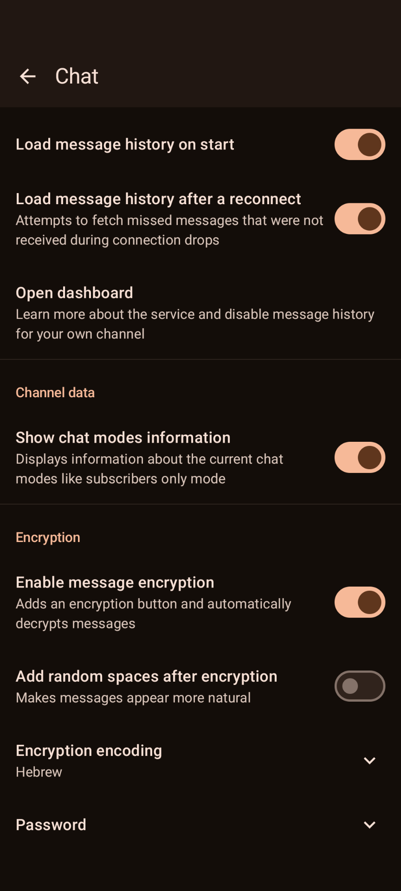
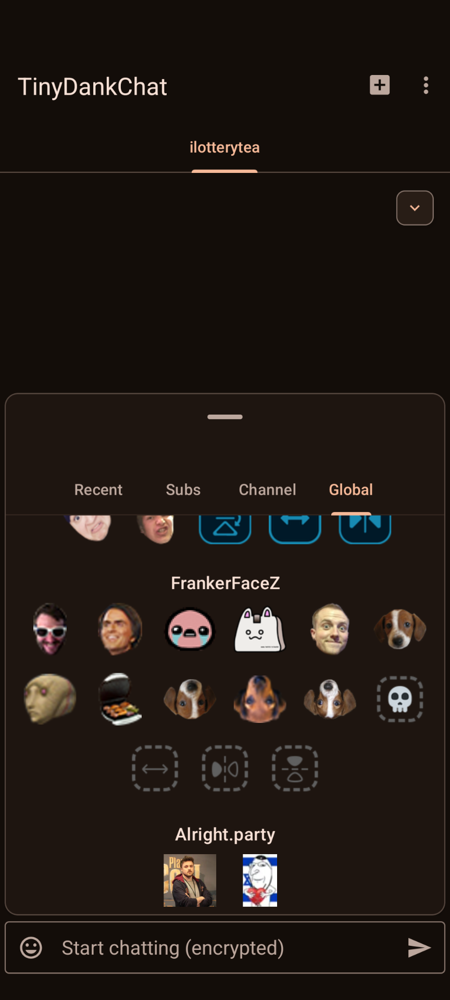
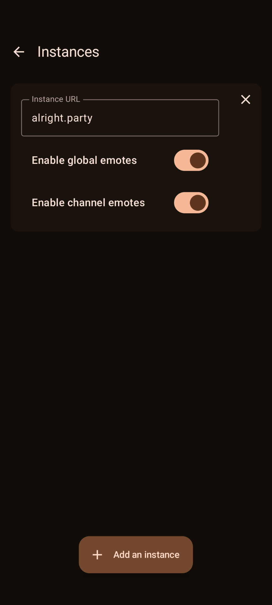

#  TinyDankChat

  
<!---->
<!--  -->

Based on [DankChat](https://github.com/flex3r/DankChat) made by @flex3rs and contributors

A signed release version is available [here](https://github.com/ilotterytea/TinyDankChat/releases/tag/release)  
Make sure to click "install anyway" when a Play Protect dialog pops up during installation.   

  
 
 

## Features

+ [TinyEmotes](https://github.com/ilotterytea/tinyemotes) support, a self-hosted emote provider
+ Client-side message encryption

## Localization
DankChat uses crowdin for translations. Except for strings in the base language, resource strings don't need to be edited anymore.  
If you want to contribute, request access to be a translator here: https://crowdin.com/project/dankchat

## Donate
Support the DankChat development and get a dank badge next to your name  
https://streamelements.com/flex3rs/tip
